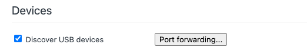
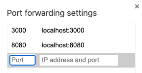

> Made by [picunada](https://github.com/picunada)

# Loyalty system

Loyalty system app is WEB3 loyalty system to cooperate brands and clients ....

## Environment

To setup env variables copy .env.example as .env file
```bash
copy .env.exmaple .env
```
## Enable PWA

To enable PWA, we need to set "enabled" flag to true in nuxt.config.ts

```ts
devOptions: {
      enabled: false,
      type: 'module',
}
```
## Run in dev environment

Install dependencies
```bash
pnpm install
```
To start application
```bash
pnpm dev
```

## To create wallet

On [welcome page](http//:localhost:3000/welcome) click "Create account button".

## To enter with seed phrase

On [welcome page](http//:localhost:3000/welcome) fill "Phrase" field and click on "From seed phrase" button.

## To test PWA

On Chrome browser open [Devices DevTools](chrome://inspect/#devices) and connect your phone with usb to your computer, with application running on 3000 port (by default).

> Click on "Port forwarding..." button



> Add "localhost:3000" in this window



> Then you can open localhost:3000 on your phone browser. And there will be a promt to install app.
